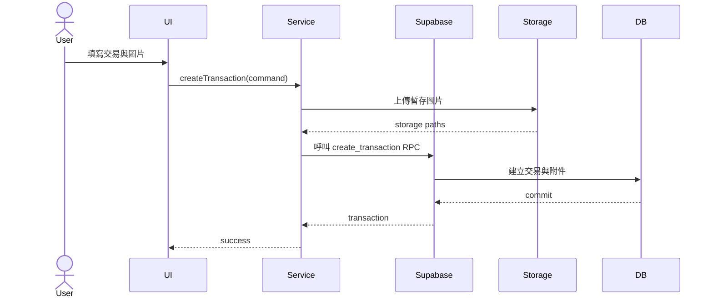

# Create Transaction Sequence

```mermaid
sequenceDiagram
  actor User
  participant UI
  participant Service
  participant Supabase
  participant Storage
  participant DB

  User->>UI: 填寫交易與圖片
  UI->>Service: createTransaction(command)
  Service->>Storage: 上傳暫存圖片
  Storage-->>Service: storage paths
  Service->>Supabase: 呼叫 create_transaction RPC
  Supabase->>DB: 建立交易與附件
  DB-->>Supabase: commit
  Supabase-->>Service: transaction
  Service-->>UI: success
```
