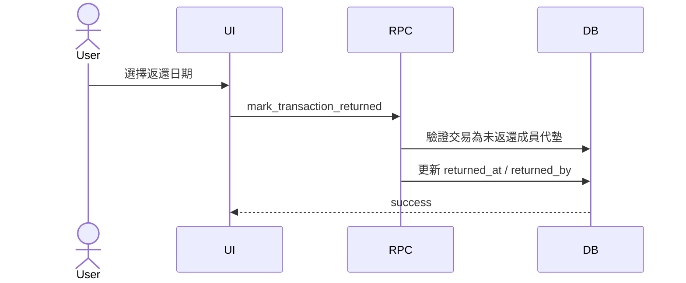

# Reimbursement Sequence

```mermaid
sequenceDiagram
  actor User
  participant UI
  participant RPC
  participant DB

  User->>UI: 選擇返還日期
  UI->>RPC: mark_transaction_returned
  RPC->>DB: 驗證交易為未返還成員代墊
  RPC->>DB: 更新 returned_at / returned_by
  DB-->>UI: success
```
